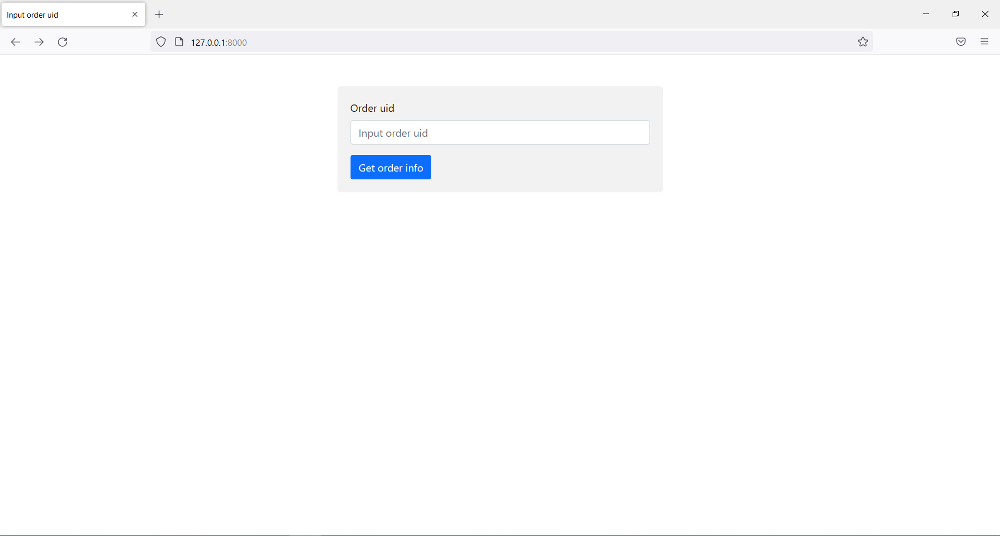

# Order service

Сервис принимает данные с информацией о заказе из канала, записывает их в базу данных и в память. Также сервис запускает http сервер, с помощью которого можно получить информацию о заказе по id.

**Orders service** - папка с кодом программы, которая принимает данные из канала.

**Channel publisher** - папка со скриптом, который публикует данные в канал.

### Модель базы данных

Ниже на картинке представлена схема базы данных, в которой хранятся данные о заказе.

*orders* - основная таблица, где хранится информация о заказе. В ней есть два поля с внешними ключами, которые ссылаются на таблицы deliveries (поле delivery_id) и payments (поле payment_id).  
*deliveries* - таблица с информацией о доставке.  
*payments* - таблица с информацией об оплате.  
*items* - здесь хранятся товары. В таблице есть поле с внешним ключом (order_uid), которое ссылается на таблицу orders. Таким образом становится понятно, какой товар к какому заказу принадлежит. 

В памяти программы информация хранится в массиве структур.

### Nats-streaming-server

Nats сервер запускается локально. Сервис подписывается на канал с помощью долгосрочной подписки. Если сервис завершает работу, то от канала он не отписывается. Таким образом, если сервис неожиданно перестал работать, после запуска он примет те сообщения из канала, которые не принял до своего вылета.

А чтобы избежать проблем, связанных с аварийной остановкой работы nats сервера, следует настроить message store так, чтобы он хранился не в памяти, а в файлах или в базе данных.

### Скриншоты интерфейса

Ниже представлены скриншоты интерфейса.

Форма, принимающая id заказа.

Страница, на которой выводится информация о заказе.

Если ввести несуществующий id.
